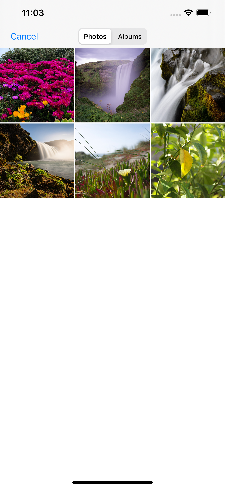
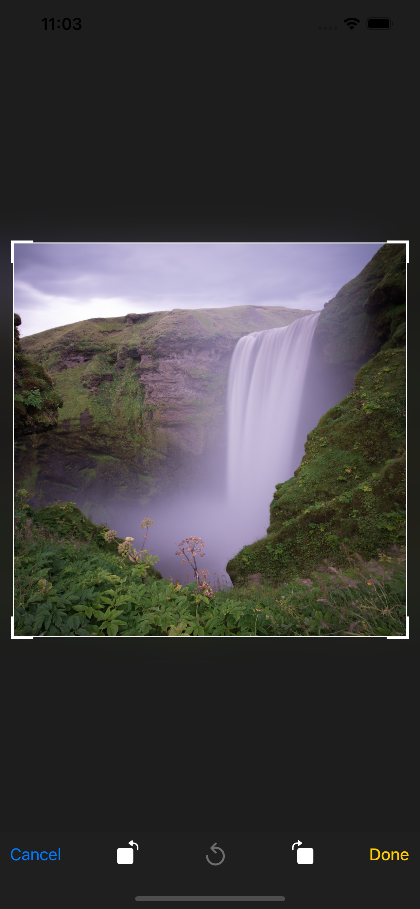
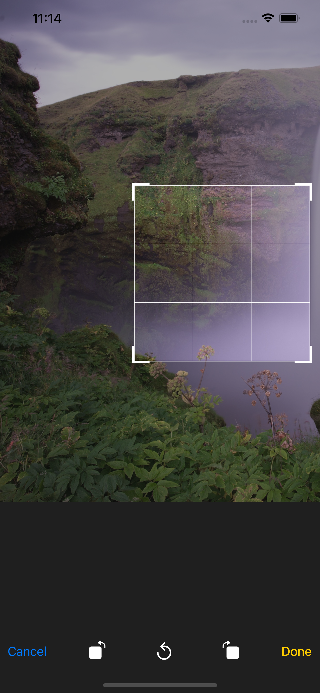
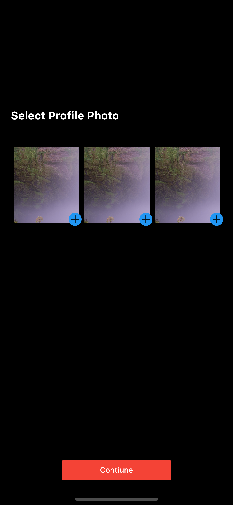

# image_picker and image_cropper

Image picker  & image cropper and cupertinosheet


## Screenshots
   

## dependencies:


```yaml
  dependencies:
    flutter:
      sdk: flutter
    image_picker: ^0.7.4
    image_cropper: ^1.4.0
```

## How to use
```dart
  enum SourceCode {
    gallery,
    camera,
  }

  class UtilsImage {
    static Future<File> imagePicker({
      @required SourceCode sourceCode,
      @required Future<File> Function(File file) croppImage,
    }) async {
      final source = sourceCode == SourceCode.gallery
          ? ImageSource.gallery
          : ImageSource.camera;
      final pickerImage = await ImagePicker().getImage(source: source);
      if (pickerImage == null) return null;
      if (croppImage == null)
        return File(pickerImage.path);
      else
        return croppImage(File(pickerImage.path));
    }
  }
```


```dart
    var imagesFile = <File>[];

  Future selectPhoto(index, sourceCode) async {
    final file = await UtilsImage.imagePicker(
      sourceCode: sourceCode,
      croppImage: croppImage,
    );
    if (file == null) return;
    if (imagesFile.length == (index + 1)) {
      imagesFile.removeAt(index);
      setState(() => imagesFile.insert(index, file));
    } else
      setState(() => imagesFile.add(file));
  }

  Future<File> croppImage(File imageFile) async {
    return await ImageCropper.cropImage(
      sourcePath: imageFile.path,
      aspectRatio: CropAspectRatio(ratioX: 1, ratioY: 1),
      maxHeight: 100,
      maxWidth: 100,
      compressFormat: ImageCompressFormat.png,
      androidUiSettings: androidUiSettingsLock(),
      iosUiSettings: iosUiSettings(),
    );
  }

  AndroidUiSettings androidUiSettingsLock() {
    return AndroidUiSettings(
      lockAspectRatio: false,
      toolbarTitle: 'Image Cropper',
      toolbarColor: Colors.orange,
      toolbarWidgetColor: Colors.white,
      activeControlsWidgetColor: Colors.white,
      hideBottomControls: true,
    );
  }

  IOSUiSettings iosUiSettings() {
    return IOSUiSettings(
      minimumAspectRatio: 1.0,
    );
  }
```
### build
```dart
_controllerImageFile(contex, index) {
    if (imagesFile.isEmpty) return displayImageFile(context, index);
    return index == 0
        ? displayImageFile(context, index, img: imagesFile[0])
        : index == 1 && imagesFile.length > 1 && imagesFile[1] != null
            ? displayImageFile(context, index, img: imagesFile[1])
            : index == 2 && imagesFile.length > 2 && imagesFile[2] != null
                ? displayImageFile(context, index, img: imagesFile[2])
                : displayImageFile(context, index);
  }

  displayImageFile(context, index, {img}) {
    final child = img == null
        ? Icon(
            Icons.image,
            color: Colors.red,
            size: 35.0,
          )
        : Image.file(
            img,
            fit: BoxFit.cover,
          );
    return Stack(
      children: [
        Container(
          margin: EdgeInsets.all(5.0),
          width: 100.0,
          height: double.infinity,
          color: Colors.white,
          child: child,
        ),
        Positioned(
          right: 0.0,
          bottom: 0.0,
          child: GestureDetector(
            onTap: () async {
              await showCupertinoModalPopup(
                context: context,
                builder: (context) => CupertinoActionSheet(
                  actions: [
                    CupertinoActionSheetAction(
                      onPressed: () {
                        Navigator.pop(context);
                        selectPhoto(index, SourceCode.gallery);
                      },
                      child: Text('Select a Photo'),
                      isDestructiveAction: true,
                    ),
                    CupertinoActionSheetAction(
                      onPressed: () {
                        Navigator.pop(context);
                        selectPhoto(index, SourceCode.camera);
                      },
                      child: Text('Take a Photo'),
                      isDestructiveAction: false,
                    ),
                    CupertinoActionSheetAction(
                      onPressed: () {
                        Navigator.pop(context);
                        if (imagesFile.isNotEmpty)
                          setState(() => imagesFile.removeAt(index));
                      },
                      child: Text('Delete Photo'),
                      isDestructiveAction: false,
                    ),
                  ],
                  cancelButton: CupertinoActionSheetAction(
                    child: Text('Çık'),
                    onPressed: () => Navigator.pop(context),
                  ),
                ),
              );
            },
            child: Container(
              padding: const EdgeInsets.all(5.0),
              decoration: BoxDecoration(
                shape: BoxShape.circle,
                color: Colors.blue,
              ),
              child: Icon(
                img != null ? Icons.edit : Icons.add,
                color: Colors.white,
              ),
            ),
          ),
        ),
      ],
    );
  }

  @override
  Widget build(BuildContext context) {
    return Scaffold(
      backgroundColor: Colors.black,
      body: Column(
        crossAxisAlignment: CrossAxisAlignment.start,
        mainAxisAlignment: MainAxisAlignment.center,
        children: [
          Container(
            margin: EdgeInsets.only(bottom: 40.0, left: 20.0),
            child: Text(
              'Select a Photo',
              style: TextStyle(
                color: Colors.white,
                fontSize: 20.0,
                fontWeight: FontWeight.bold,
              ),
            ),
          ),
          Container(
            margin: EdgeInsets.only(left: 20.0),
            width: MediaQuery.of(context).size.width,
            height: 150.0,
            color: Colors.black,
            child: ListView.builder(
              physics: NeverScrollableScrollPhysics(),
              scrollDirection: Axis.horizontal,
              itemCount: 3,
              itemBuilder: (context, index) =>
                  _controllerImageFile(context, index),
            ),
          )
        ],
      ),
    );
  }
}
```
### Android  path => android/app/src/main/AndroidManifest.xml
 

```activity
   <activity
      android:name="com.yalantis.ucrop.UCropActivity"
      android:screenOrientation="portrait"
      android:theme="@style/Theme.AppCompat.Light.NoActionBar"/>
```

### IOS   path => ios/Runner/Info.plist

```keys
    <key>NSCameraUsageDescription</key>
    <string>Explanation on why the camera access is needed.</string>	
    <key>NSPhotoLibraryUsageDescription</key>
    <string>Privacy - Photo Library Usage Description</string>	
    <key>NSMicrophoneUsageDescription</key>
    <string>Privacy - Microphone Usage Description</string>
```
## Getting Started

This project is a starting point for a Flutter application.

A few resources to get you started if this is your first Flutter project:

- [Lab: Write your first Flutter app](https://flutter.dev/docs/get-started/codelab)
- [Cookbook: Useful Flutter samples](https://flutter.dev/docs/cookbook)

For help getting started with Flutter, view our
[online documentation](https://flutter.dev/docs), which offers tutorials,
samples, guidance on mobile development, and a full API reference.
