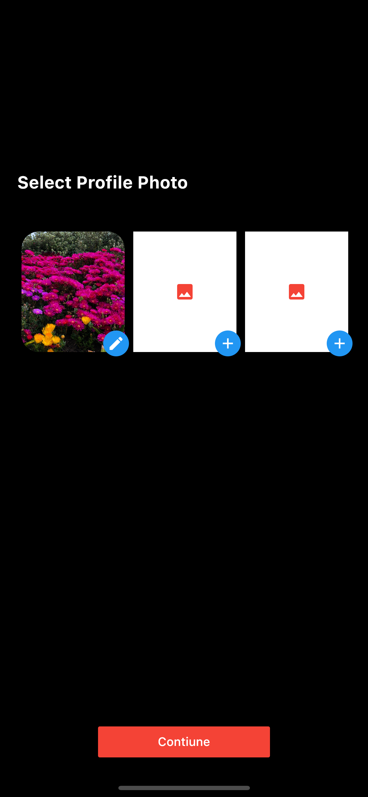

# image_picker and image_cropper

Image picker  & image cropper and cupertinosheet


## Screenshots
   

## dependencies:


```yaml
  dependencies:
    flutter:
      sdk: flutter
    image_picker: ^0.7.4
    image_cropper: ^1.4.0
```

## How to use

### UtilsImage Class
```dart
 import 'dart:io';
import 'package:flutter/cupertino.dart';
import 'package:image_picker/image_picker.dart';

class UtilsImage {
  static Future<File> mediaPicker({
    @required bool isGallery,
    @required Function(File file) croppImage,
  }) async {
    final source = isGallery ? ImageSource.gallery : ImageSource.camera;
    final pickerImage = await ImagePicker().getImage(source: source);
    if (pickerImage == null) return null;
    if (croppImage == null)
      return File(pickerImage.path);
    else
      return croppImage(File(pickerImage.path));
  }
}
```
## example

```dart
   ImagePicker(
    title: 'Flutter Select Photo',
    itemCount: 4,
    height: 120.0,
    selectionPhoto: (file) {
      print(file.length);
    },
    backgroundColor: Colors.black,
  ),
```
### ImagePicker class
```dart
class ImagePicker extends StatefulWidget {
  final String title;
  IconData iconAdd;
  IconData iconEdit;
  Color backgroundColor;
  Color backgroundImage;
  Color buttonColor;
  Color iconColor;
  double height;
  double width;
  final int itemCount;
  final Function(List<File>) selectionPhoto;
  AndroidUiSettings androidUiSettingsLock;
  IOSUiSettings iosUiSettings;
  ImagePicker({
    Key key,
    @required this.selectionPhoto,
    this.title,
    IconData iconAdd,
    IconData iconEdit,
    Color backgroundImage,
    Color backgroundColor,
    Color buttonColor,
    Color iconColor,
    double height,
    double width,
    this.itemCount,
    AndroidUiSettings androidUiSettingsLock,
    IOSUiSettings iosUiSettings,
  })  : backgroundColor = backgroundColor ?? Colors.black,
        backgroundImage = backgroundImage ?? Colors.white,
        buttonColor = buttonColor ?? Colors.blue,
        iconColor = iconColor ?? Colors.white,
        iconAdd = iconAdd ?? Icons.add,
        iconEdit = iconEdit ?? Icons.edit,
        height = height ?? 200.0,
        width = width ?? 100.0,
        androidUiSettingsLock = androidUiSettingsLock ??
            AndroidUiSettings(
              lockAspectRatio: false,
              toolbarTitle: 'Image Cropper',
              toolbarColor: Colors.orange,
              toolbarWidgetColor: Colors.white,
              activeControlsWidgetColor: Colors.white,
              hideBottomControls: true,
            ),
        iosUiSettings = iosUiSettings ??
            IOSUiSettings(
              minimumAspectRatio: 1.0,
            ),
        assert(itemCount >= 3),
        super(key: key);

  @override
  _ImagePickerState createState() => _ImagePickerState();
}
```
### Android  path => android/app/src/main/AndroidManifest.xml
 

```activity
   <activity
      android:name="com.yalantis.ucrop.UCropActivity"
      android:screenOrientation="portrait"
      android:theme="@style/Theme.AppCompat.Light.NoActionBar"/>
```

### IOS   path => ios/Runner/Info.plist

```keys
    <key>NSCameraUsageDescription</key>
    <string>Explanation on why the camera access is needed.</string>	
    <key>NSPhotoLibraryUsageDescription</key>
    <string>Privacy - Photo Library Usage Description</string>	
    <key>NSMicrophoneUsageDescription</key>
    <string>Privacy - Microphone Usage Description</string>
```
## Getting Started

This project is a starting point for a Flutter application.

A few resources to get you started if this is your first Flutter project:

- [Lab: Write your first Flutter app](https://flutter.dev/docs/get-started/codelab)
- [Cookbook: Useful Flutter samples](https://flutter.dev/docs/cookbook)

For help getting started with Flutter, view our
[online documentation](https://flutter.dev/docs), which offers tutorials,
samples, guidance on mobile development, and a full API reference.
