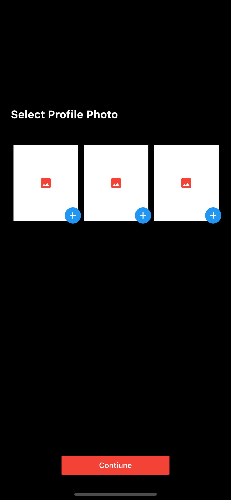
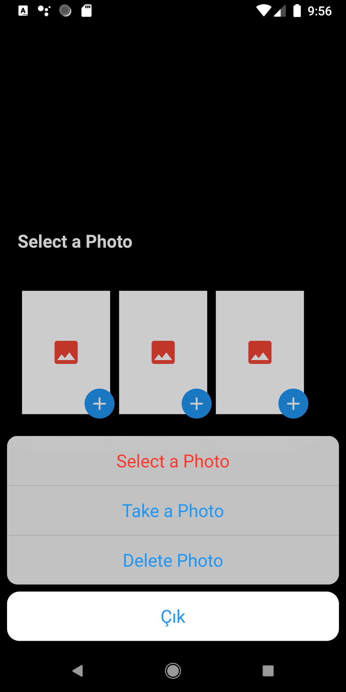

# image_picker and image_cropper

A new Project Flutter 

## Screenshots
   

## dependecies:
 
  '''
  image_picker: ^0.7.4
   
  image_cropper: ^1.4.0
   
  '''
## Android
 path => android/app/src/main/AndroidManifest.xml
  
 copy this 
  
    '''
     
     <activity
        android:name="com.yalantis.ucrop.UCropActivity"
         
        android:screenOrientation="portrait"
         
        android:theme="@style/Theme.AppCompat.Light.NoActionBar"
         
      />
       
      paste in the path directory for ### image_picker
       
    '''
     
## IOS 
 
path => ios/Runner/Info.plist
 
copy this:
 
'''
 
<key>NSCameraUsageDescription</key>
 
<string>Explanation on why the camera access is needed.</string>	<key>NSPhotoLibraryUsageDescription</key>
 
<string>Privacy - Photo Library Usage Description</string>	<key>NSCameraUsageDescription</key>
 
<string>Privacy - Camera Usage Description</string>
 
<key>NSMicrophoneUsageDescription</key>
 
<string>Privacy - Microphone Usage Description</string>
 
'''
 
paste in the path directory for ### image_cropper
 
## Getting Started

This project is a starting point for a Flutter application.

A few resources to get you started if this is your first Flutter project:

- [Lab: Write your first Flutter app](https://flutter.dev/docs/get-started/codelab)
- [Cookbook: Useful Flutter samples](https://flutter.dev/docs/cookbook)

For help getting started with Flutter, view our
[online documentation](https://flutter.dev/docs), which offers tutorials,
samples, guidance on mobile development, and a full API reference.
